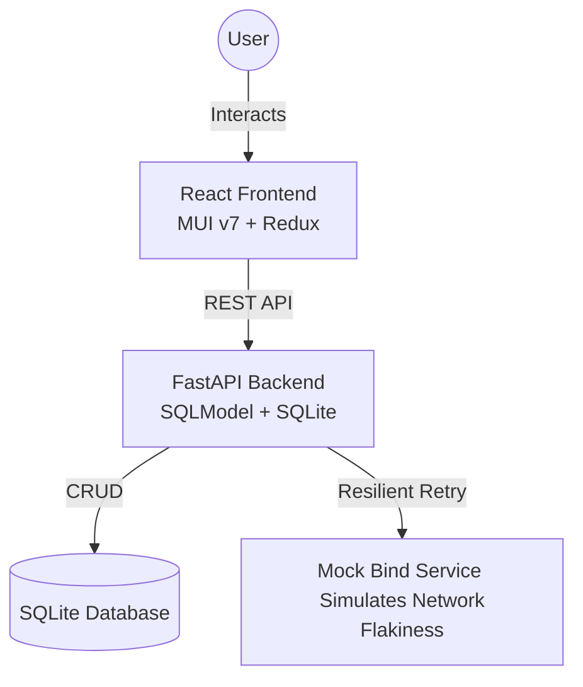

# 🚀 Great Subs: Resilient Submission Management

[]()
[]()
[]()
[]()

A high-performance, resilient submission management system designed to demonstrate modern microservices patterns, concurrent processing, and fault tolerance.

---

## 🏗️ System Architecture

Great Subs is built on a distributed architecture that emphasizes **reliability in the face of instability**.



### Core Components

| Component                          | Technology                         | Description                                                         |
| :--------------------------------- | :--------------------------------- | :------------------------------------------------------------------ |
| **[Frontend Client](./client)**    | React 19, TypeScript, MUI v7, RTK  | Premium UI with real-time feedback and state management.            |
| **[Backend API](./api)**           | FastAPI, SQLModel, Tenacity, HTTPX | Central orchestrator handling business logic and resilience.        |
| **[Bind Service](./bind-service)** | FastAPI                            | A specialist mock service that simulates 50% failure/latency rates. |

---

## 🛡️ Technical Highlights

### 1. The "Bind" Workflow (Resilience & Concurrency)

One of the project's core technical highlights is the atomic "Bind" operation. It ensures a submission is processed exactly once, even under heavy concurrency or flaky network conditions.

#### The Distributed Lock Mechanism

When a user clicks "Bind", the system manages the state using a `claimed_at` timestamp:

1. **Atomic Claim**: The API performs an atomic SQL update. A submission is only claimable if `claimed_at` is `NULL` or older than 45 seconds (handling crashed processes).
2. **Conflict Handling**: If the update fails (0 rows affected), a `409 Conflict` is returned, preventing duplicate processing.
3. **External Integration**: Once claimed, the `bind_client.py` calls the external service.
4. **Resilient Retries**: Using `tenacity`, the system automatically handles the flaky `bind-service`. It retries on $500$ or $504$ errors with exponential backoff.
5. **State Finalization**: Upon success or total exhaustion of retries, the status is updated to `bound` or `bind_failed`, and the claim is released.

### 2. Frontend

- **Global Error & Success Handling**: Custom Redux middleware globally intercepts API responses to display appropriate `react-toastify` alerts for both successes and errors.
- **Optimistic UI**: Mutates the local cache directly on CRUD operations for an immediate, snappier feel without unnecessarily refetching full arrays.
- **Theme-Driven Design**: Features a custom MUI theme integrating modern typography, reusable form components (Search, Selects), and distinct thematic buttons.
- **Advanced Data Table**: Integrated support for comprehensive submission filtering, real-time searching, and dynamic column sorting.

---

## 🚦 Getting Started

### Prerequisites

- **Local Dev**: Node.js (v20+ recommended), Python (v3.9+).
- **Containerized**: Docker and Docker Compose (V2).

---

### 💻 Option 1: Local Development Script

Use this for the fastest development cycle with hot-reloading.

1. **Clone the repository**:

   ```bash
   git clone <repo-url>
   cd great-subs
   ```

2. **Run the startup script**:
   ```bash
   chmod +x run.sh
   ./run.sh
   ```

**What happens next?**

- The script checks for `venv` and `node_modules` in each service.
- It installs missing dependencies automatically.
- It starts all three services in the background.
- **Stop all services**: Simply press `Ctrl+C`. The script's trap handler will clean up all background processes.

**Access Points:**

- **UI**: [http://localhost:5173](http://localhost:5173) (Vite Dev Server)
- **API Docs**: [http://localhost:8000/docs](http://localhost:8000/docs)
- **Bind Service Docs**: [http://localhost:8001/docs](http://localhost:8001/docs)

---

### 🐳 Option 2: Docker Compose

Ideal for consistent environment testing or shared preview environments.

1. **Spin up the stack**:

   ```bash
   docker-compose up -d --build
   ```

2. **Monitor the logs**:

   ```bash
   docker-compose logs -f
   ```

3. **Shutdown**:
   ```bash
   docker-compose down
   ```

**What happens here?**

- Each service is containerized using optimized Dockerfiles.
- The `client` is built and served via **Nginx**.
- The `api` waits for `bind-service` healthchecks before accepting traffic.
- Persistence is handled via the `api-data` Docker volume.

**Access Points:**

- **UI**: [http://localhost:3000](http://localhost:3000) (Nginx Proxy)
- **API Reference**: [http://localhost:8000/docs](http://localhost:8000/docs)
- **Bind Service**: [http://localhost:8001/docs](http://localhost:8001/docs)

---

## 📁 Project Structure

```text
great-subs/
├── api/                # FastAPI Backend + SQLModel
│   ├── routers/        # API Endpoints (Submissions, etc.)
│   ├── tests/          # Pytest Integration Tests
│   ├── bind_client.py  # Resilient HTTP Client
│   ├── crud.py         # Database Operations
│   ├── models.py       # Entity Models
│   ├── main.py         # Application root
│   └── README.md       # API-specific documentation
├── bind-service/       # Mock service (simulates failures)
│   └── README.md       # Bind-service documentation
├── client/             # React 19 + TypeScript + MUI
│   ├── src/            # Theme, Components, Store, Pages
│   ├── nginx.conf      # Production config for Docker
│   └── README.md       # Client-specific documentation
├── docker-compose.yml  # Multi-container orchestration
└── run.sh             # Combined dev environment startup script
```

> **Note**: Each individual service (`api`, `bind-service`, `client`) contains its own dedicated `README.md` with deep-dive technical breakdowns and localized setup instructions.

---
