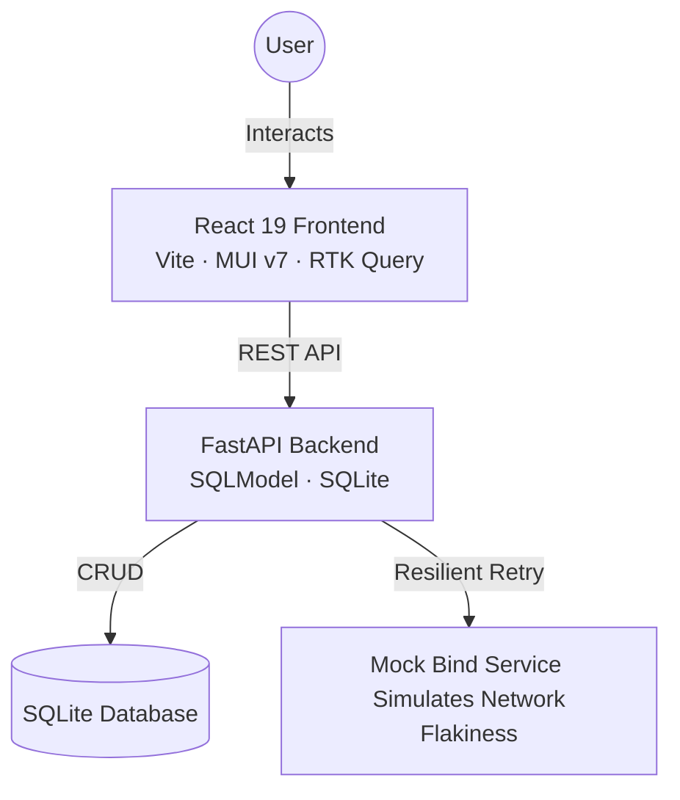

# 🚀 Great Subs: Submission Management

[]()
[]()
[]()
[]()

A full-stack submission management system designed to handle CRUD operations on submissions and interact with an unstable external "bind" service. The system demonstrates resilient retry strategies, optimistic UI updates, and a distributed-lock mechanism for safe concurrency.

---

## 🏗️ System Architecture



---

## 📦 Core Components

| Component                          | Stack                                                    | Purpose                                                                 |
| :--------------------------------- | :------------------------------------------------------- | :---------------------------------------------------------------------- |
| **[Frontend Client](./client)**    | React 19, TypeScript 5.9, Vite 7, MUI v7, RTK Query, Zod | Premium UI with real-time feedback, form validation, and optimistic UX. |
| **[Backend API](./api)**           | FastAPI, SQLModel, Tenacity, HTTPX, Pytest               | Central orchestrator handling business logic and resilience.            |
| **[Bind Service](./bind-service)** | FastAPI, Uvicorn                                         | A mock service simulating ~50% failure & timeout rates.                 |

---

## 🔍 Deep Dive — Technology Breakdown

### 1. Frontend Client (`./client`)

#### Core Framework & Build

- **React 19** with `StrictMode` enabled
- **TypeScript ~5.9** in strict mode — all types use `readonly` properties and explicit return annotations
- **Vite 7** as the dev server and bundler, configured with a `@/` path alias for clean imports

#### UI & Styling

- **MUI v7 (`@mui/material`)** — Tables, Dialogs, Chips, AppBar, Pagination, and more; all styled via the `styled()` API for theme-aware, co-located styles
- **`@emotion/react` / `@emotion/styled`** — CSS-in-JS engine powering MUI's `styled()` utility
- **`@mui/icons-material`** — Material Design icons (`AddIcon`, `DeleteIcon`, `EditIcon`, `BoltIcon`, `SearchIcon`, etc.)
- **Custom MUI theme (`theme.ts`)** — curated HSL color palettes for light/dark modes, Roboto typography, global `borderRadius` of 10
- **Dark mode toggle** — implemented via React Context (`ColorModeContext`) and a custom `useLocalStorage` hook; auto-detects OS preference on first visit and persists across sessions

#### State Management & Data Fetching

- **RTK Query (`@reduxjs/toolkit/query`)** — all API communication defined in a single `api.ts` slice with auto-generated hooks (`useGetSubmissionsQuery`, `useBindSubmissionMutation`, etc.)
- **Optimistic cache updates** — every mutation (create, update, delete, bind) patches the RTK Query cache directly via `onQueryStarted` before the server responds; on failure, patches are rolled back via `.undo()`
- **Custom Redux middlewares** — `errorMiddleware` intercepts rejected actions and displays contextual `toast.error()` / `toast.warn()` notifications; `successMiddleware` intercepts fulfilled actions and shows `toast.success()` messages from the server
- **`react-toastify`** — non-blocking toast notifications, themed to match the current light/dark mode

#### Forms & Validation

- **React Hook Form** — performant form management with `Controller` for MUI `TextField` integration
- **Zod + `@hookform/resolvers`** — schema-based validation (`z.string().min(1, ...)`) bridged to React Hook Form via `zodResolver`
- **Server-side error mapping** — on `400` responses (e.g., duplicate name), errors are mapped back to form fields via `setError("name", ...)`

#### Component Architecture

```
src/
├── components/          # Shared, reusable UI primitives
│   ├── Header/          # AppBar with logo, theme toggle
│   ├── inputs/          # CustomSelectBox, SearchInput (debounced)
│   ├── layouts/         # PageContainer, PageHeader, StateContainer
│   └── typography/      # Semantic wrappers: H4, P, Subtitle
├── hooks/               # useLocalStorage (generic, typed)
├── pages/Submissions/   # Feature page with sub-components:
│   ├── SubmissionList     # Data table with MUI TablePagination
│   ├── SubmissionRow      # Row with status Chip, BindButton, edit/delete
│   ├── SubmissionForm     # Dialog form (create/edit) with Zod validation
│   ├── SubmissionFilters  # Status select + debounced search input
│   └── BindButton         # 3-state button: Bind / Binding… / Retry
├── providers/           # ThemeProviderWrapper (dark mode context)
├── store/               # Redux store, RTK Query api slice, middlewares
└── types/               # Strict TypeScript types with readonly properties
```

#### Testing

- **Vitest** with `jsdom` environment and global test utilities
- **React Testing Library** + **`@testing-library/jest-dom`** for DOM-based, accessibility-first assertions

#### Production Build (Docker)

Multi-stage Dockerfile:

1. **Builder** (`node:20-alpine`) — `npm ci` + `npm run build`
2. **Runtime** (`nginx:alpine`) — serves `dist/` via Nginx with SPA routing (`try_files`) and `/api/` proxy to the backend

---

### 2. Backend API (`./api`)

#### Core Framework

- **FastAPI ≥0.110** with lifespan context manager for DB initialization on startup, automatic OpenAPI docs, and `Depends`-based dependency injection
- **Uvicorn ≥0.29** as the ASGI server (`--reload` in dev, `--log-level info` in Docker)
- **CORS middleware** allowing requests from `localhost:5173` (Vite) and `localhost:3000` (Nginx)

#### ORM & Database

- **SQLModel ≥0.0.16** — hybrid SQLAlchemy ORM + Pydantic validation in a single model class; the `Submission` model serves as both the DB table definition and the schema base
- **SQLite** — embedded, zero-configuration database; persisted via a Docker volume (`api-data`); engine configured with `check_same_thread=False`
- **Data model**: UUID primary keys, `created_at`/`updated_at` UTC timestamps, `claimed_at` field (distributed lock), unique constraint on `name`, paginated queries with status/name filtering, default sort by `created_at DESC`

- **SQLAlchemy `update()`** — atomic `UPDATE ... WHERE` acting as a distributed lock; a submission is claimable only if `claimed_at` is `NULL` or older than 45 seconds
- **`run_in_threadpool`** — offloads synchronous SQLModel operations to a thread pool to avoid blocking the async event loop
- **HTTPX** — async HTTP client for calling the bind service with configurable timeouts (5s)
- **Tenacity** — retry decorator: 5 max attempts, exponential backoff (1s–10s), retries on `500`/`504` and on `TimeoutException`/`ConnectError`, with a `before_sleep` logging callback

#### API Endpoints

| Method   | Endpoint                 | Description                                    |
| :------- | :----------------------- | :--------------------------------------------- |
| `GET`    | `/submissions/`          | Paginated list with status/name filters        |
| `POST`   | `/submissions/`          | Create a new submission (unique name enforced) |
| `GET`    | `/submissions/{id}`      | Fetch a single submission                      |
| `PATCH`  | `/submissions/{id}`      | Partial update (name, status)                  |
| `DELETE` | `/submissions/{id}`      | Delete a submission                            |
| `POST`   | `/submissions/{id}/bind` | Trigger the resilient bind workflow            |

#### Logging

Custom `build_logger` utility producing structured output:

```
2026-03-15T10:00:00 | INFO     | api.submissions | bind_submission | Bind requested — submission_id=...
```

#### Testing

- **Pytest ≥8.0** + **pytest-asyncio ≥0.24** for async test support
- **In-memory SQLite** with `StaticPool` — fully isolated per-test fixtures via conftest
- **FastAPI `TestClient`** — simulates HTTP requests with dependency injection overrides for the database session

#### Production Build (Docker)

- Base image: `python:3.12-slim`
- DB path overridden via `DATABASE_URL` env var to `/app/data/database.db`
- Runs Uvicorn as the container entrypoint

---

### 3. Bind Service (`./bind-service`)

An intentionally **flaky** mock that simulates an unreliable external API.

#### Stack

- **FastAPI** — single `/bind` endpoint with auto-generated OpenAPI docs
- **Uvicorn** — lightweight ASGI server

#### Failure Simulation

Uses `random.random()` to produce three outcomes:

| Roll Range    | Outcome         | HTTP Response                          |
| :------------ | :-------------- | :------------------------------------- |
| `0.00 – 0.49` | ✅ Success      | `200 OK` — `{ "status": "success" }`   |
| `0.50 – 0.79` | ❌ Server Error | `500 Internal Server Error`            |
| `0.80 – 1.00` | ⏱️ Timeout      | Sleeps 15s, then `504 Gateway Timeout` |

#### Production Build (Docker)

- Base image: `python:3.11-slim`
- Copies only `main.py` and `requirements.txt`
- Docker Compose healthcheck via `/docs`

---

## 🐳 Infrastructure & DevOps

### Docker Compose

- **Service dependencies**: `api` → `bind-service` (healthy) → `client` → `api` (healthy)
- **Healthchecks**: Python `urllib` scripts validating `/docs` endpoints
- **Volume persistence**: Named `api-data` volume for the SQLite database
- **Internal DNS**: Services communicate via Docker networking (e.g., `http://bind-service:8001/bind`)

### Local Development Script (`run.sh`)

1. Creates Python venvs and installs deps for each Python service (if missing)
2. Installs `node_modules` for the client (if missing)
3. Starts all three services as background processes
4. `trap` handler on `SIGINT`/`SIGTERM` cleanly stops all processes on `Ctrl+C`

---

## 🚦 Getting Started

### Prerequisites

- **Local Dev**: Node.js (v20+ recommended), Python (v3.9+).
- **Containerized**: Docker and Docker Compose (V2).

---

### 💻 Option 1: Local Development Script

1. **Clone the repository**:

   ```bash
   git clone <repo-url>
   cd great-subs
   ```

2. **Run the startup script**:
   ```bash
   chmod +x run.sh
   ./run.sh
   ```

**Access Points:**

- **UI**: [http://localhost:5173](http://localhost:5173) (Vite Dev Server)
- **API Docs**: [http://localhost:8000/docs](http://localhost:8000/docs)
- **Bind Service Docs**: [http://localhost:8001/docs](http://localhost:8001/docs)

---

### 🐳 Option 2: Docker Compose

1. **Spin up the stack**:

   ```bash
   docker-compose up -d --build
   ```

2. **Monitor the logs**:

   ```bash
   docker-compose logs -f
   ```

3. **Shutdown**:
   ```bash
   docker-compose down
   ```

**Access Points:**

- **UI**: [http://localhost:3000](http://localhost:3000) (Nginx Proxy)
- **API Reference**: [http://localhost:8000/docs](http://localhost:8000/docs)
- **Bind Service**: [http://localhost:8001/docs](http://localhost:8001/docs)

---

## 📁 Project Structure

```text
great-subs/
├── api/                        # FastAPI Backend
│   ├── routers/submissions.py  # REST endpoints + bind workflow
│   ├── tests/                  # Pytest suites (CRUD + bind client)
│   ├── bind_client.py          # Resilient HTTP client (Tenacity + HTTPX)
│   ├── crud.py                 # Database operations (paginated queries)
│   ├── models.py               # SQLModel entities + Pydantic schemas
│   ├── database.py             # Engine setup + session factory
│   ├── logger.py               # Structured logging utility
│   ├── main.py                 # App factory with lifespan + CORS
│   └── README.md               # API-specific documentation
├── bind-service/               # Mock flaky service (simulates failures)
│   ├── main.py                 # Single /bind endpoint with RNG logic
│   └── README.md               # Bind-service documentation
├── client/                     # React 19 + TypeScript + MUI v7
│   ├── src/
│   │   ├── components/         # Header, inputs, layouts, typography
│   │   ├── hooks/              # useLocalStorage
│   │   ├── pages/Submissions/  # Feature page with sub-components
│   │   ├── providers/          # ThemeProviderWrapper (dark mode)
│   │   ├── store/              # Redux store, RTK Query slice, middlewares
│   │   ├── tests/              # Vitest + React Testing Library
│   │   ├── types/              # Strict TypeScript interfaces
│   │   └── theme.ts            # Custom MUI theme (HSL palettes)
│   ├── nginx.conf              # Production Nginx config (SPA + API proxy)
│   └── README.md               # Client-specific documentation
├── docker-compose.yml          # Multi-container orchestration
└── run.sh                      # Local dev startup script
```

> **Note**: Each individual service (`api`, `bind-service`, `client`) contains its own dedicated `README.md` with deep-dive technical breakdowns and localized setup instructions.

---
